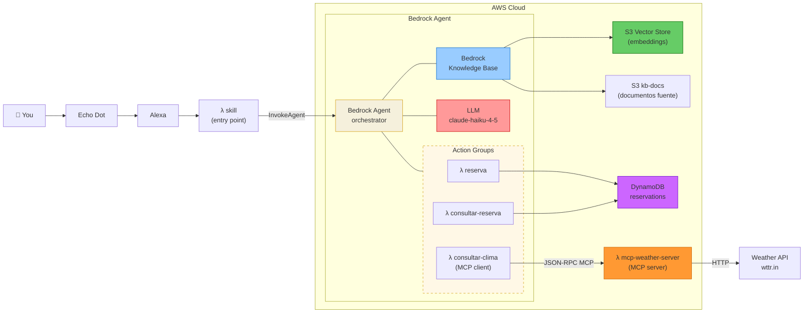

# Airline Agent Demo

Agente conversacional para aerolíneas construido sobre **Amazon Bedrock Agents**. Permite reservar vuelos, consultar reservaciones y responder preguntas sobre políticas de equipaje, cancelaciones y mascotas — a través de una Lambda HTTP o una Alexa Skill.

## Arquitectura



## Estructura del proyecto

```
airline-agent-demo/
│
├── lambdas/
│   ├── skill/                  # Entry point: Alexa + HTTP, invoca el agente
│   ├── reserva/                # Action group: crea reservación en DynamoDB
│   ├── consultar-reserva/      # Action group: consulta reservación por ID
│   ├── consultar-clima/        # Action group: MCP client → weather server
│   └── mcp-weather-server/     # MCP server: expone consultar_clima via JSON-RPC
│
├── knowledge-base/
│   └── docs/
│       ├── equipaje.md
│       ├── cancelaciones.md
│       └── mascotas.md
│
├── alexa/                   # Alexa Skill manifest e interaction model (es-ES, es-US, es-MX)
│
├── infra/                   # Terraform
│   ├── main.tf
│   └── modules/
│       ├── dynamodb/
│       ├── iam/
│       ├── lambdas/
│       └── bedrock-agent/   # Agent + KB + S3 Vectors + Action Groups
│
├── scripts/
│   ├── deploy.sh
│   ├── destroy.sh
│   └── seed-kb.sh
│
├── Makefile
└── .env.example
```

## Prerrequisitos

- [Terraform](https://developer.hashicorp.com/terraform/install) >= 1.6
- [AWS CLI](https://aws.amazon.com/cli/) configurado (`aws configure`)
- Python 3.12 (solo para desarrollo local)
- Acceso a modelos habilitado en Bedrock (región `us-east-1`):
  - `us.anthropic.claude-haiku-4-5-20251001-v1:0` (cross-region inference profile)
  - `amazon.titan-embed-text-v2:0`

## Quick start

### 1. Configurar variables de entorno

```bash
cp .env.example .env
# editar .env con tu región y perfil de AWS si es necesario
```

### 2. Desplegar infraestructura

```bash
make deploy
```

Al finalizar se imprimen los outputs:

```
agent_id                    = "XXXXXXXXXX"
agent_alias_id              = "YYYYYYYYYY"
knowledge_base_id           = "ZZZZZZZZZZ"
skill_function_url          = "https://xxxxxxxx.lambda-url.us-east-1.on.aws/"
reserva_function_name       = "airlines-app-dev-reserva"
consultar_reserva_function_name = "airlines-app-dev-consultar-reserva"
```

### 3. Cargar documentos en la Knowledge Base

```bash
make seed
```

Sube los `.md` de `knowledge-base/docs/` a S3 y dispara el ingestion job. Espera ~1-2 minutos a que el job finalice antes de probar.

### 4. Probar

```bash
# Nueva conversación
curl -X POST <skill_function_url> \
  -H "Content-Type: application/json" \
  -d '{"message": "quiero reservar un vuelo"}'

# Continuar sesión
curl -X POST <skill_function_url> \
  -H "Content-Type: application/json" \
  -d '{"message": "para Juan Pérez, vuelo AA123, el 2025-05-20", "session_id": "<session_id>"}'

# Consultar política de equipaje (KB)
curl -X POST <skill_function_url> \
  -H "Content-Type: application/json" \
  -d '{"message": "cuántas maletas puedo llevar en economy?"}'
```

## API de la skill Lambda

**Request**

```json
{
  "message": "quiero reservar un vuelo",
  "session_id": "opcional-para-continuar-conversacion"
}
```

**Response**

```json
{
  "session_id": "abc-123",
  "response": "Con gusto te ayudo a reservar un vuelo. ¿A qué destino..."
}
```

## Capacidades del agente

| Capacidad | Fuente |
|---|---|
| Reservar vuelo | Lambda `reserva` → DynamoDB |
| Consultar reservación | Lambda `consultar-reserva` → DynamoDB |
| Políticas de equipaje | Knowledge Base (RAG) |
| Políticas de cancelación | Knowledge Base (RAG) |
| Viaje con mascotas | Knowledge Base (RAG) |
| Consulta de clima | MCP client → MCP server Lambda → wttr.in |

## MCP Weather Stack

El agente invoca `consultar-clima` (action group / MCP client) que se comunica con `mcp-weather-server` (Lambda con Function URL) usando el protocolo MCP estándar (JSON-RPC 2.0, `protocolVersion: 2024-11-05`). El server expone `tools/list` y `tools/call` y llama a `wttr.in` sin API key.

## Makefile

```
make deploy    # terraform init + apply + outputs
make seed      # sube docs a S3 y dispara ingestion job
make destroy   # destruye toda la infraestructura (pide confirmación)
```

## Infraestructura desplegada

| Recurso | Descripción |
|---|---|
| `aws_bedrockagent_agent` | Agente Bedrock con Claude Haiku 4.5 (cross-region inference) |
| `aws_bedrockagent_knowledge_base` | KB con Titan Embed v2 |
| `aws_s3vectors_vector_bucket` | Vector store (pay-per-use, sin costo fijo) |
| `aws_s3vectors_index` | Índice vectorial (cosine, 1024 dims, float32) |
| `aws_s3_bucket` | Bucket S3 para documentos fuente |
| `aws_dynamodb_table` | Tabla de reservaciones (PAY_PER_REQUEST) |
| `aws_lambda_function` × 5 | skill, reserva, consultar-reserva, consultar-clima, mcp-weather-server |
| `aws_iam_role` × 2 | Lambda, Bedrock Agent (KB role en módulo bedrock-agent) |

## Alexa developer console

```bash
npm install -g ask-cli
ask configure
make alexa
```

## Destruir

```bash
make destroy
```

Pide confirmación antes de ejecutar. Elimina todos los recursos de AWS.
